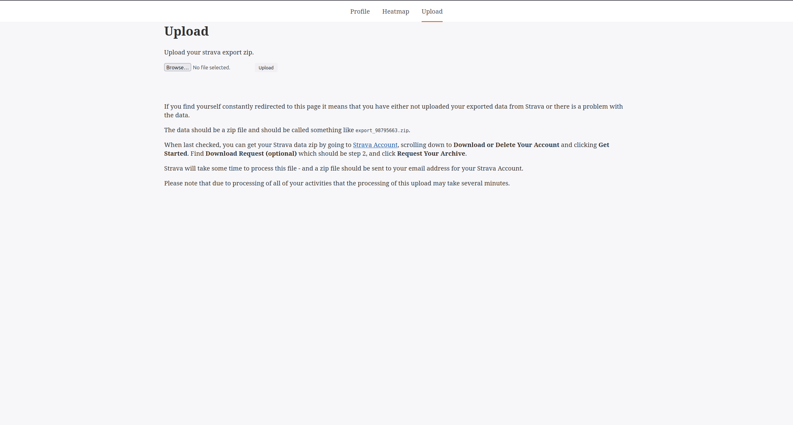
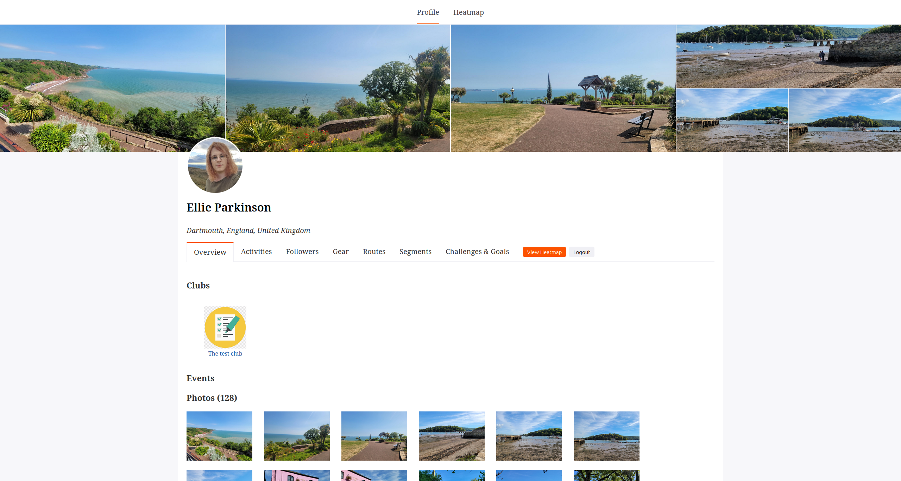
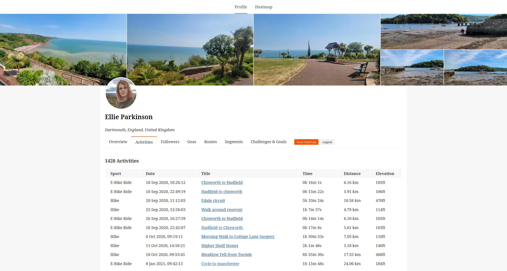
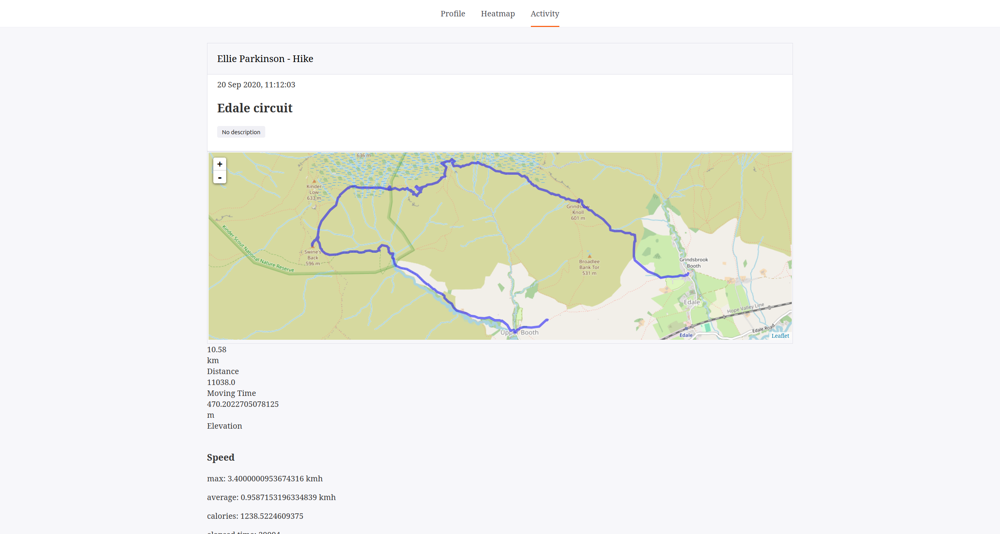
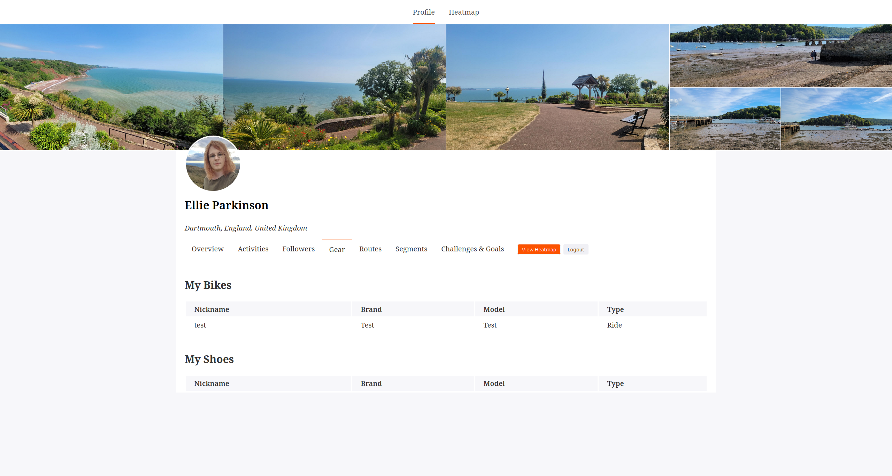
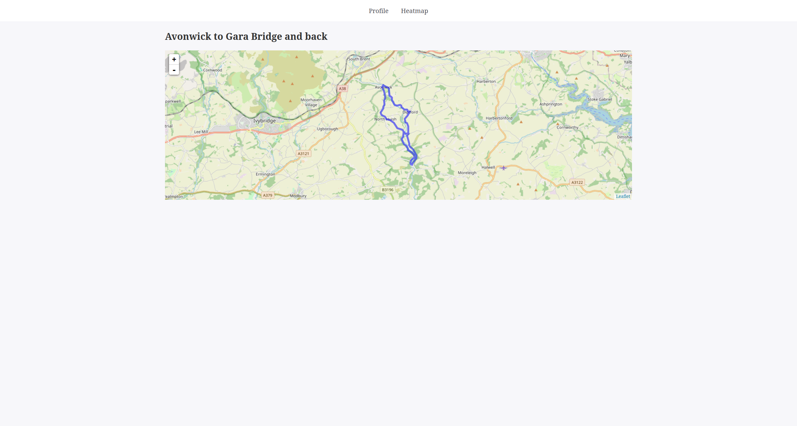
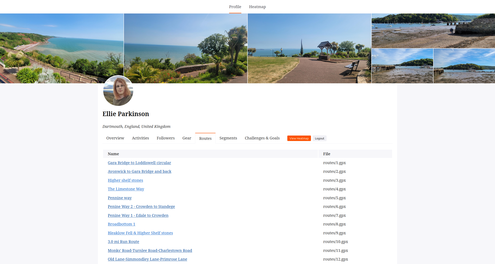

# Strava Data Viewer

Designed to view the data you have exported from your Strava account.

## Requirements
### Deno
The Deno runtime must be installed. Please see installation instructions:
https://deno.land/manual/getting_started/installation

### Env Files
The env file is extremely important. Without it this will not function. If you decide to enable oauth with USE_OPENID please be sure to appropriately fill out the other environment variables.

### Usage

Start the project:

```
deno task start
```

The project will start on port 3000 http://localhost:3000/


## About
This is a viewer for export.zip files from Strava. It is not the same as solutions such as https://github.com/robiningelbrecht/strava-statistics (which is fantastic and you should definitely take a look at). These are designed to connect to the Strava API and to get data from there. Strava exports have significantly less detailed data within them. However, if you have (for example) already exported your Strava data and deleted your account / do not want to access the API - this is a solution that might work for you.

The application can render most data from your Strava export, shows map views of Routes and acitivities - and generates a heatmap from your activities. 

## Screenshots







